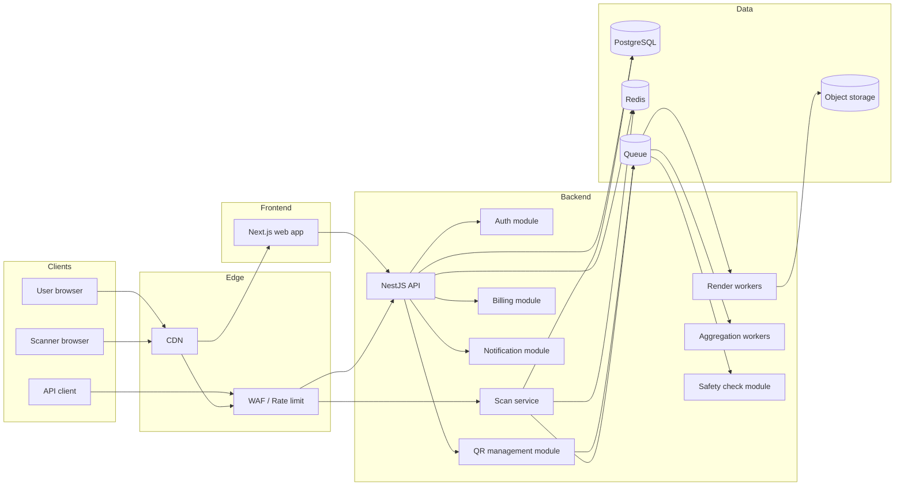

# 05 — Architecture

## Recommended stack

The source analysis explicitly recommends a balanced stack of Next.js + NestJS + PostgreSQL + Redis + Cloudflare edge for an analogue with extensions. Adopt that as the default architecture.

## High-level topology

## Separation of concerns

### Management path
Used for:
- auth
- CRUD
- design
- billing
- dashboard
- team features

### Scan path
Used for:
- short-link resolution
- status checks
- password checks
- redirect or landing response
- async event emission

The source analysis is right here: mixing dashboard CRUD with scan-path requirements is bad design.

## Service responsibilities

### Web app
- public marketing pages
- generator wizard
- dashboard
- auth screens
- pricing and billing UI
- API reference UI

### API service
- authenticated business logic
- validation
- permissions
- persistence
- signed URLs for assets
- admin/dash data

### Render workers
- generate PNG/SVG/PDF/JPG/EPS
- run heavy jobs async
- cache repeated renders
- emit metadata

### Scan service
- slug resolution
- status gate checks
- redirect-rule evaluation
- password gate
- enqueue scan event
- return redirect or landing response fast

### Analytics workers
- consume raw events
- upsert daily aggregates
- deduplicate unique scan logic
- maintain geo/device summaries

### Billing module
- Stripe customer/subscription lifecycle
- quota updates
- entitlements
- invoice sync

### Notification module
- per-scan email/webhook
- future digest notifications
- retry logic
- delivery logs

### Safety module
- malicious link/file checks
- async provider integration
- moderation flags

## Core data flows

## Create QR
1. client submits content + design
2. API validates content schema and permissions
3. API stores QR core rows
4. API enqueues render jobs
5. worker renders assets
6. assets uploaded to object storage
7. API returns short URL + download references

## Scan QR
1. scanner requests short URL
2. scan service resolves slug from Redis, fallback PG
3. checks inactive/expired/password/rules
4. emits raw event to queue
5. returns redirect or landing page
6. analytics workers update daily aggregates later

## Billing webhook
1. Stripe sends webhook
2. API verifies signature
3. idempotently updates subscription state
4. recalculates entitlements and quotas
5. records invoice state

## Storage strategy

### PostgreSQL
System of record for:
- users
- workspaces
- QR metadata
- billing state
- analytics aggregates

### Redis
Use for:
- slug routing cache
- rate limits
- short-lived session data
- queue backing if using BullMQ

### Object storage
Use for:
- rendered assets
- uploaded logos/files
- template previews

## Performance rules

- never do synchronous PDF/EPS generation inside request path
- scan service should not wait on analytics aggregate update
- keep slug lookup hot in Redis
- paginate dashboard lists
- precompute common analytics ranges where useful

## Edge strategy

Use CDN/WAF for:
- public assets
- download delivery
- cache headers for public landing pages when safe
- DDoS/rate limit around scan path and auth/API

## Deployment suggestion

- `apps/web` on Vercel or containerized Next runtime
- `apps/api` on container platform
- `scan` can initially live inside API app, but keep module boundary and route isolation so it can be split later
- managed PostgreSQL
- managed Redis
- S3-compatible storage
